## CIFAR-10 dataset
* [Kaggle Notebook](https://www.kaggle.com/code/kartikeysharmaah/1dt114-notebook-1)
* ran for 150 epochs
* hard to generate *'cat'* and *'dog'* samples
* *'horses'* were easy to generate
---
**Observations**   
Generated samples for labels: *frog*, *cars*, *horse*, *airplane*, *ships*, and *trucks*.

`FAKE`
<table>
<tr>
<td>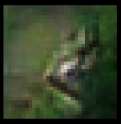</td>
<td></td>
<td>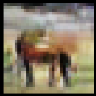</td>
<td></td>
</tr>
<tr>
<td>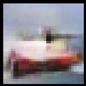</td>
<td></td>
<td>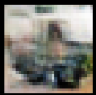</td>
<td>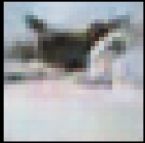</td>
</tr>
<tr>
<td>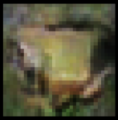</td>
<td>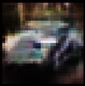</td>
<td>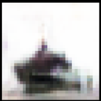</td>
<td></td>
</tr>
</table>

`REAL`
<table>
<tr>
<td>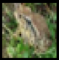</td>
<td></td>
<td>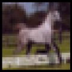</td>
<td></td>
</tr>
<tr>
<td></td>
<td></td>
<td></td>
<td></td>
</tr>
<tr>
<td></td>
<td></td>
<td>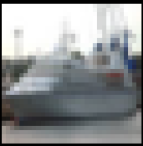</td>
<td></td>
</tr>
</table>
