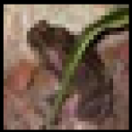
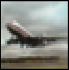

## CIFAR-10 dataset
* Hard to fine-tune **WGAN-GP**
* sensitive to hyperparameters
* hard to generate *'cat'* and *'dog'* samples
* easy to generate *'horse'* and *'planes'*
---
**Observations**   
Generated samples for labels: *frog*, *cars*, *horse*, *airplane*, *ships*, and *trucks*.

`FAKE`
<table>
<tr>
<td></td>
<td></td>
<td></td>
<td></td>
<td></td>
</tr>
<tr>
<td></td>
<td></td>
<td></td>
<td></td>
<td></td>
</tr>
</table>

`REAL`
<table>
<tr>
<td></td>
<td></td>
<td></td>
<td></td>
<td></td>
</tr>
<tr>
<td></td>
<td></td>
<td></td>
<td></td>
<td></td>
</tr>
</table>
