## HuggingFace Diffusers
* imported U-net model
* imported noise scheduler
* generated images *don't* have artifacts
* generated images are less blurred
* more diverse compared to WGAN

---
**Observations**   
*sampled MNIST images*

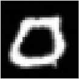
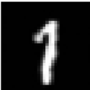
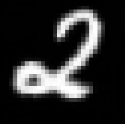
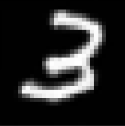
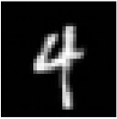

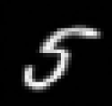
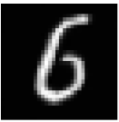
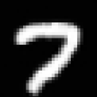
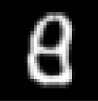
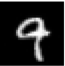

*sampled CIFAR-10 images*

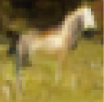
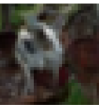
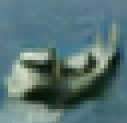
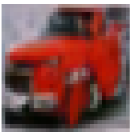
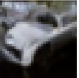

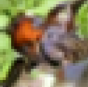
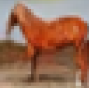
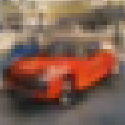
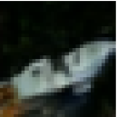
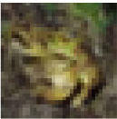

