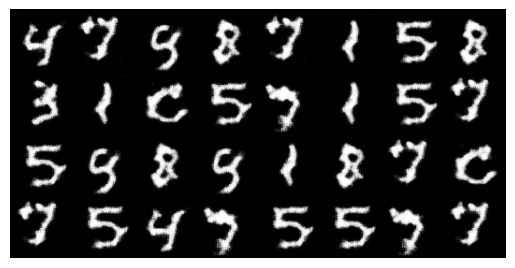
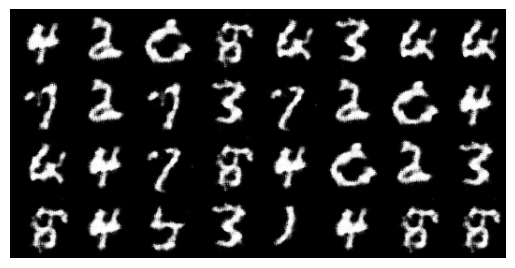
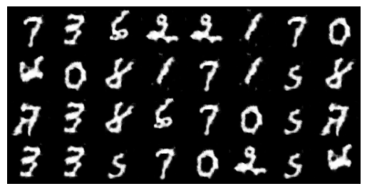
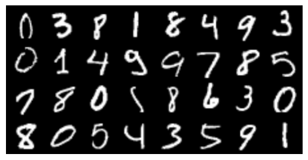
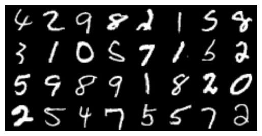
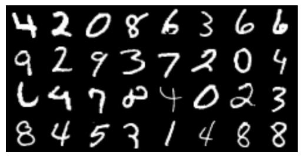
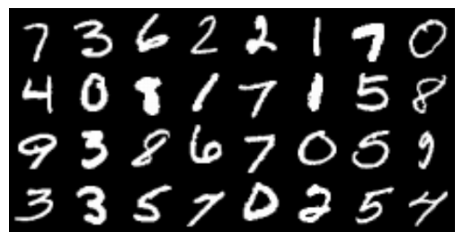

# MNIST dataset 
* Critic does not have Sigmoid
* Train for about 100 epochs
* Hard to generate digits *8* and *9*
* These digits get learned at about 200 epochs
---

**Observations**
Following images were generated after *100* epochs. Top ones are generated, and bottom ones are real.

