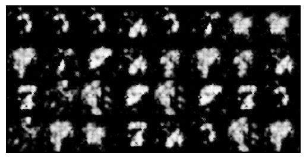
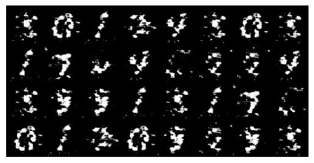
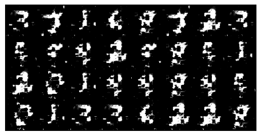
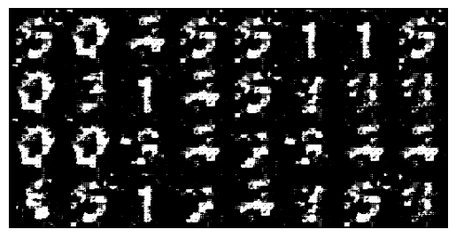
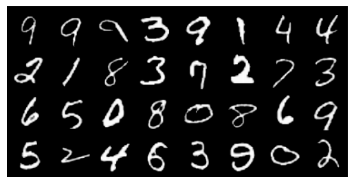
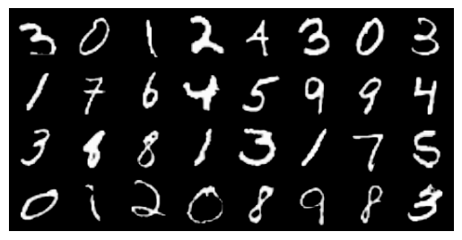
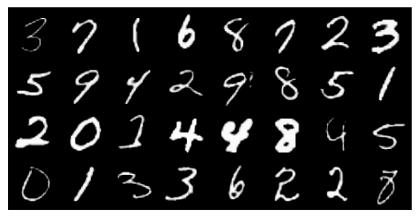
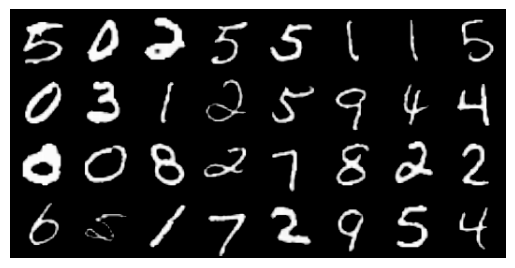

# MNIST dataset 
* Generate handwritten digit images
* Hard to fine-tune
* Train for more epochs (>=400)
* Hard to generate digit *8* and *9*
* These digits get learned at about 300 epochs
---

**Observations**

Images generated at epochs = *5*, *50*, *150*, and *200*, respectively.

---

