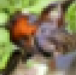

# WGAN-GP vs Denoising Diffusion (DDPMs)
* ran on MNIST and CIFAR-10 datasets
* Both Models perform well on MNIST
* For CIFAR-10, WGAN-GP suffer from
  * blurred images
  * *artifacts*, and
  * hyper-parameter tuning
* DDPMs generate less blurred images and train faster
---

**Observations**    
*From WGAN-GP*

*From DDPM*

`All sample images can be viewed in the README files present in each folder.`
