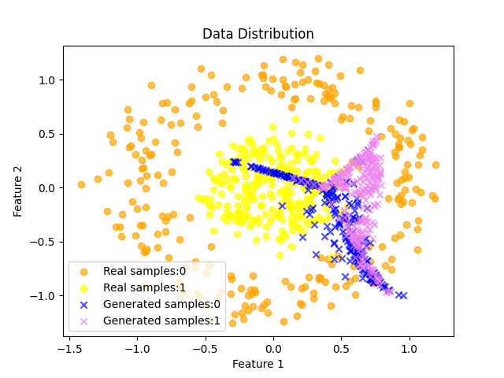
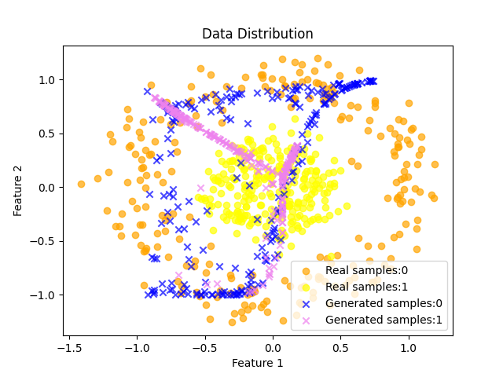
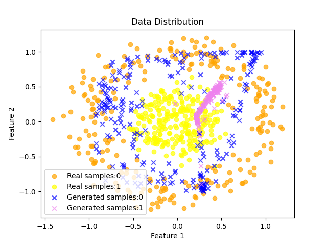
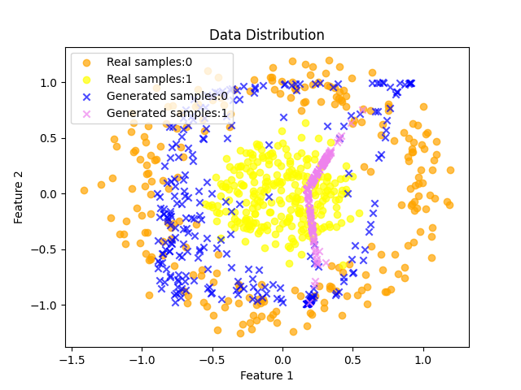
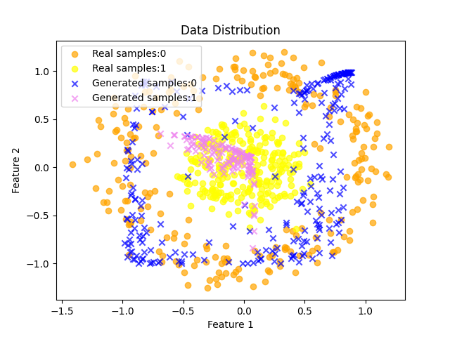
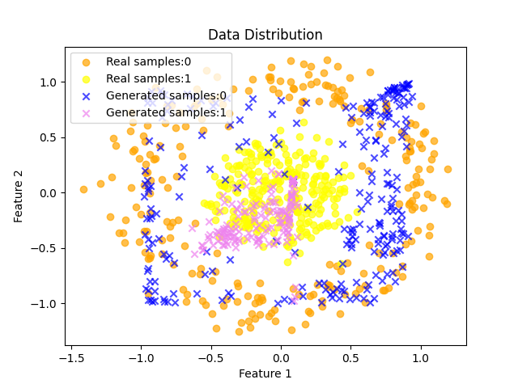
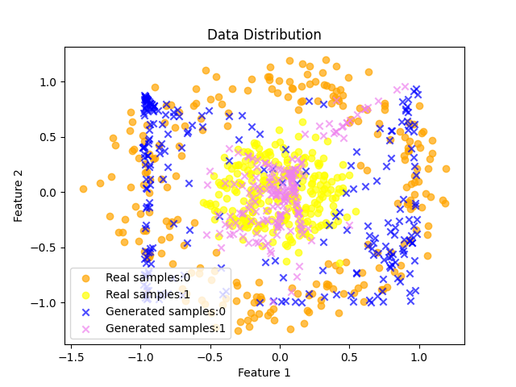
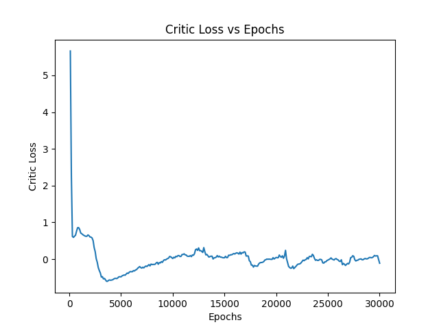

# Toy Samples
* Generated toy samples using sklearn
* Trained conditional WGAN-GP
* Produce diverse samples, and
* Mitigate mode collapse
* Added inter-sample distance to Generator loss
---

**Observations**

---

**Critic Loss Trend**

